# Loading Dashboards
In this hand-on-lab, we will create a new WPF application and use the `Reveal SDK` to embed a **Marketing** dashboard.

Helpful links:

* [Assets](https://github.com/RevealBi/RevealRoadshow-2020/tree/master/HandsOnLab/Assets)
* [Loading Dashboards - Before](https://github.com/RevealBi/RevealRoadshow-2020/tree/master/HandsOnLab/Samples/Samples-Before/01-LoadDashboard)
* [Loading Dashboards - Completed](https://github.com/RevealBi/RevealRoadshow-2020/tree/master/HandsOnLab/Samples/Samples-After/01-LoadDashboard)

### 1. Create Project
Using Visual Studio 2019, use the "Create a new Project" dialog to search for the WPF App project template. Be sure to select the **WPF App (.NET Framework)** option and click the `Next` button.

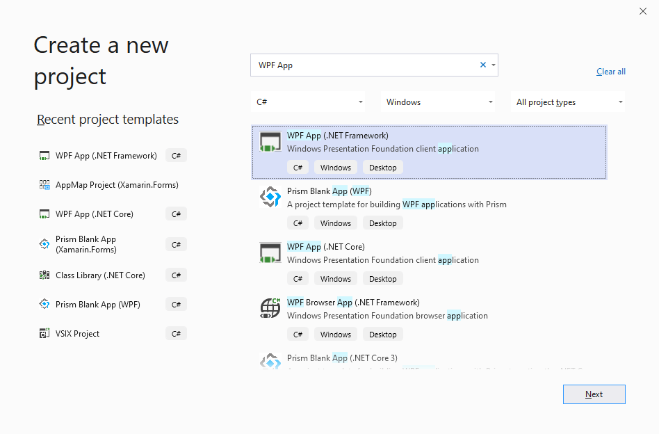

On the "Configure your new project" dialog, provide a name for your project. In this example, we are calling our project "RevealLab". Select a location for this project to be created on your local disk, and make sure you have the latest version of the .NET Framework selected. When you have competed all fields of the dialog, press the `Create` button to create your WPF project.

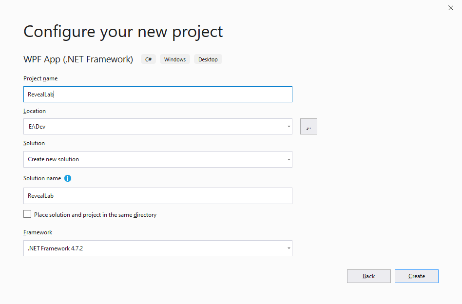

Your project should be created and loaded within Visual Studio.

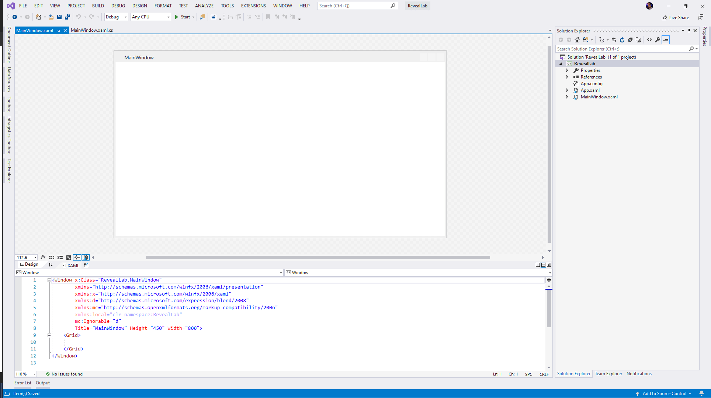

### 2. Add NuGet Packages
Right click your solution and select "Manage NuGet Packages".

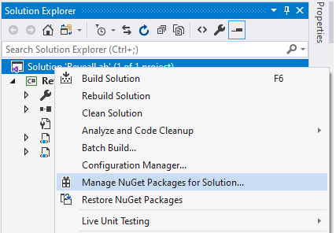

When the "Manage Packages for Solution" tab opens, be sure to change your "Package Source" to **"Infragistics (Local)"**. This package source is automatically created for you when you install the Reveal SDK. The location of this source is located at `%public%\Documents\Infragistics\NuGet`.

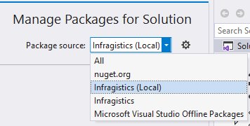

After you have changed the package source, select the "Browse" option and search for **Infragistics.Reveal.Sdk.Wpf.Trial**

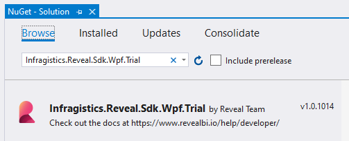

Select the check box located in the "Project" list next to the `RevealLab` project. Click the "Install" button and follow the remaining dialog prompts to install the latest version of the **Reveal SDK**.

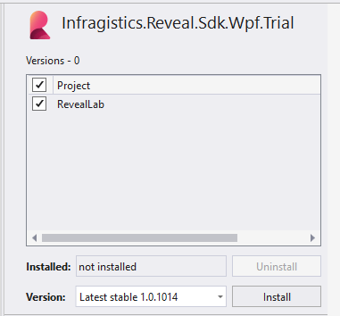

### 3. Handle CefSharp Dependency Package
After the **Reveal SDK** NuGet package and all of its dependencies has been installed, we must update the `csproj` file to fix a potential build error with the `CefSharp` dependency. To do this, we must first unload the project by right-clicking the project and selecting the `Unload Project` option from the menu.

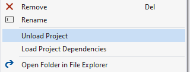

After the project has been unloaded, we can now edit the `csproj` file by right-clicking the project name and selecting the `Edit RevealLab.csproj` option from the menu.

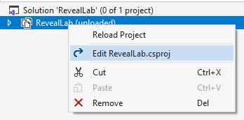

This will open the `csproj` file in a text editor which will allow use to edit the contents of the file. Add the following property group to your applications `csproj` file.

```html
<PropertyGroup>
  <CefSharpAnyCpuSupport>true</CefSharpAnyCpuSupport>
</PropertyGroup>
```

After you have edited the `csproj` file to add the property group provided above, you can now reload your project. Right-click the project name and select the `Reload Project` option fro the menu.

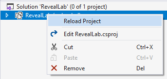

This will reload your project and your project is now set up to display Reveal dashboards.

### 4. Add RevealView Control
Open the `MainWindow.xaml` file and define a new `xmlns` namespace as follows:

```
xmlns:bi="clr-namespace:Infragistics.Sdk;assembly=RVUI.WPF"
```

With the namespace defined, we can now create an instance of our `RevealView` UI control in the `MainWindow.xaml`. Within the content of the `Grid` element, define an instance of the `RevealView` control as shown below.

```html
<Grid>
    <bi:RevealView x:Name="_revealView" />
</Grid>
```
Be sure to give your `RevealView` control an `x:Name`. This will allow you to access the control instance in the `MainWindow` code-behind.

### 5. Add a Dashboard to the Project
Now that our project has a RevealView to display our dashboards, we must have a dashboard to display. Create a new folder in your project call `Dashboards`.

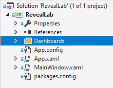

Take the dashboard file named `Marketing.rdash` found under the <a href="https://github.com/RevealBi/RevealRoadshow-2020/tree/master/HandsOnLab/Assets" target="_blank">Assets</a> folder and add it to your newly created `Dashboards` folder.

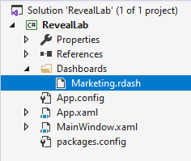

Be sure to set the `Build Action` of the `Marketing.rdash` file to `Content` , and set the `Copy to Output Directory` option to `Copy if newer` in the properties window. This will make sure that the dashboard file is copied to disk when the project is built, and it will be placed in a folder called `Dashboards`.

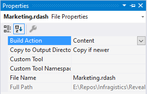

Now that we have a dashboard added to our project, it's time to load the dashboard into the `RevealView` UI control.

### 6. Load Dashboard
Open the `MainWindow.xaml.cs` file and add an event handler for the `Loaded` event as follows:

```csharp
public MainWindow()
{
    InitializeComponent();
    Loaded += MainWindow_Loaded;
}

private void MainWindow_Loaded(object sender, RoutedEventArgs e)
{
    
}
```
The first step is to get the path of the `Marketing.rdash` file we want to load into the `RevealView`. To do this, we simply create a variable named `marketingDashboardPath` to hold the location. We get the location by combining the path of the current directory, and the folder location of th `Marketing.rdash` file.  Your code should look like the following:

```csharp
private void MainWindow_Loaded(object sender, RoutedEventArgs e)
{
    var marketingDashboardPath = Path.Combine(Environment.CurrentDirectory, "Dashboards/Marketing.rdash");
}
```

Next, we need to open a `FileStream` using the `File.OpenRead` method. Since the `File.OpenRead` method is disposable, we need to place it in a `using` block to make sure we dispose of the stream as soon as we are done reading the contents of the file. Within this using statement, we use the `RevealUtility.LoadDashboard` method to load the contents of the `Marketing.rdash` file into an `RVDashboard` object.

It is not obvious at first, but the `RevealUtility.LoadDashboard` is an awaitable method. This means we must add the `async` keyword to our event handler definition.

```csharp
private async void MainWindow_Loaded(object sender, RoutedEventArgs e)
{            
    var marketingDashboardPath = Path.Combine(Environment.CurrentDirectory, "Dashboards/Marketing.rdash");

    RVDashboard dashboard = null;
    using (var fileStream = File.OpenRead(marketingDashboardPath))
    {
        dashboard = await RevealUtility.LoadDashboard(fileStream);
    }
}
```

The last step is to create a new `RevealSetting` object and use the `RVDashboard` instance we just loaded as an argument for the `RevealSettings` constructor.

```csharp
    _revealView.Settings = new RevealSettings(dashboard);
```

Your final event handler should look like the following:

```csharp
private async void MainWindow_Loaded(object sender, RoutedEventArgs e)
{            
    var marketingDashboardPath = Path.Combine(Environment.CurrentDirectory, "Dashboards/Marketing.rdash");

    RVDashboard dashboard = null;
    using (var fileStream = File.OpenRead(marketingDashboardPath))
    {
        dashboard = await RevealUtility.LoadDashboard(fileStream);
    }
    _revealView.Settings = new RevealSettings(dashboard);
}
```

### 7. Run the App
To run the application in debug mode, press the `F5` key on your keyboard.

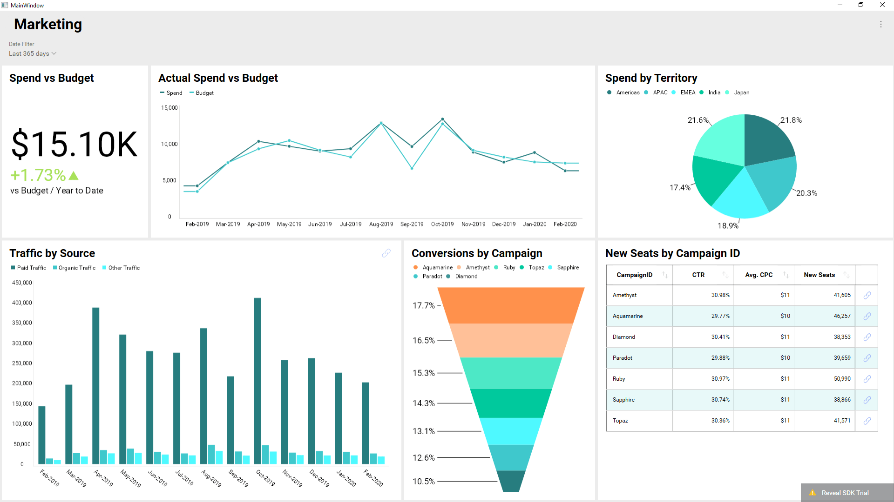