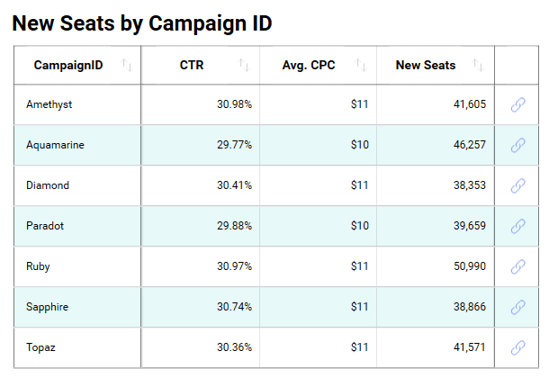

# Deep Linking Dashboards
The `Reveal SDK` supports dashboard deep linking, which allows users to navigate through dashboards. By moving from dashboard to dashboard, you can go from a high level overview of the business' reality to a more detailed view with the specifics.

Visualizations within a dashboard that link to other dashboards are visualized with the "chain link" icon. When you click on the "chain link" icon, a popup will appear with information about that specific item, and a button to link into another dashboard as seen below.


This walk-through builds on the previous ["Loading Dashboards"](https://github.com/RevealBi/RevealRoadshow-2020/blob/master/HandsOnLab/Instructions/01-LoadDashboard.md) exercise.

### 1. Add a Linked Dashboard
If you haven't completed the the "Loading Dashboards" exercise, you can use the previously [completed application](https://github.com/RevealBi/RevealRoadshow-2020/tree/master/HandsOnLab/Samples/Samples-Before/02-DashboardLinking) as a starting point for this walk-through.

Make sure your WPF project has been opened with Visual Studio 2019. Take the dashboard file named `Campaigns.rdash` found under the <a href="https://github.com/RevealBi/RevealRoadshow-2020/tree/master/HandsOnLab/Assets" target="_blank">Assets</a> folder and add it to your project's `Dashboards` folder.


This dashboard is preconfigured to work with the already existing `Marketing.rdash` dashboard to and supports linking.

Be sure to set the `Build Action` of the `Campaigns.rdash` file to `Content` , and set the `Copy to Output Directory` option to `Copy if newer` in the properties window. This will make sure that the dashboard file is copied to disk when the project is built, and it will be placed in a folder called `Dashboards`.


Now that we have the dashboard added to our project, it's time to load the dashboard into the `RevealView` UI control when a link is clicked on a visualization in the `Marketing` dashboard.

### 2. Handle VisualizationLinkingDashboard Event
The first step to implementing dashboard linking is to create an event handler for the `RevealView.VisualizationLinkingDashboard` event inside of the `MainWindow.xaml.cs` constructor.

```csharp
public MainWindow()
{
    InitializeComponent();
    Loaded += MainWindow_Loaded;

    _revealView.VisualizationLinkingDashboard += RevealView_VisualizationLinkingDashboard;
}

private void RevealView_VisualizationLinkingDashboard(object sender, VisualizationLinkingDashboardEventArgs e)
{

}
```

Next, you must invoke the `e.Callback` method with the ID of the target dashboard and the stream of the target `.rdash` file. To do this, we simply create a variable named `campaignsDashboardPath` to hold the location. We get the location by combining the path of the current directory, and the folder location of the `Campaigns.rdash` file.  Your code should look like the following:

```csharp
private void RevealView_VisualizationLinkingDashboard(object sender, VisualizationLinkingDashboardEventArgs e)
{
    var campaignsDashboardPath = Path.Combine(Environment.CurrentDirectory, "Dashboards/Campaigns.rdash");
}
```

Now, we need to open a `FileStream` using the `File.OpenRead` method. Since the `File.OpenRead` method is disposable, we need to place it in a `using` block to make sure we dispose of the stream as soon as we are done reading the contents of the file. Within this using statement, we call the `VisualizationLinkingDashboardEventArgs.Callback` method while providing "Campaigns" as the ID of the dashboard and the file stream of the contents of the `Campaigns.rdash` file.

Your final event handler code should look something like this:

```csharp
private void RevealView_VisualizationLinkingDashboard(object sender, VisualizationLinkingDashboardEventArgs e)
{
    var campaignsDashboardPath = Path.Combine(Environment.CurrentDirectory, "Dashboards/Campaigns.rdash");
    using (var fileStream = File.OpenRead(campaignsDashboardPath))
    {
        e.Callback("Campaigns", fileStream);
    }
}
```

### 3. Run the App
To run the application in debug mode, press the `F5` key on your keyboard.  When the application launches, you will be presented with the `Marketing` dashboard. 

Locate the "New Seats by Campaign ID" visualization, and click on one of the link icons in the grid.



When the link popup opens, click the `Open Campaigns` button. 


Immediately after you click on the `Open Campaigns` button, the `Campaigns` dashboard will be rendered and the `CampaignID` of the selected grid item will be used to filter the visualizations on the `Campaigns` dashboard.


Get the finished project here: [Loading Dashboards - Completed](https://github.com/RevealBi/RevealRoadshow-2020/tree/master/HandsOnLab/Samples/Samples-After/02-DashboardLinking)