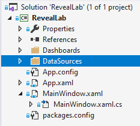
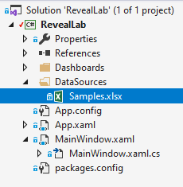
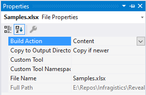
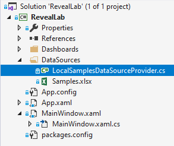

# Using a Local Data Source

This walk-through builds on the previous ["Dashboard Linking"](https://github.com/RevealBi/RevealRoadshow-2020/blob/master/HandsOnLab/Instructions/02-DashboardLinking.md) exercise.

### 1. Add a Data Source
If you haven't completed the the "Dashboard Linking" exercise, you can use the previously [completed application](https://github.com/RevealBi/RevealRoadshow-2020/tree/master/HandsOnLab/Samples/Samples-Before/03-LocalDataSource) as a starting point for this walk-through.

Make sure your WPF project has been opened with Visual Studio 2019. Create a new folder in your project call `DataSources`.



Take the Excel file named `Samples.xlsx` found under the <a href="https://github.com/RevealBi/RevealRoadshow-2020/tree/master/HandsOnLab/Assets" target="_blank">Assets</a> folder and add it to your newly created `DataSources` folder.



This Excel Spreadsheet is prepopulated with all the required Worksheets and data to work with the already existing `Marketing.rdash` and `Campaigns.rdash` dashboards.

Be sure to set the `Build Action` of the `Samples.xlsx` file to `Content` , and set the `Copy to Output Directory` option to `Copy if newer` in the properties window. This will make sure that the Excel file is copied to disk when the project is built, and it will be placed in a folder called `Dashboards`.



### 2. Create Custom IRVDataSourceProvider
In order to use our newly added `Samples.xlsx` Excel file as our local data source, we need to create a custom implementation of the `IRVDataSourceProvider` to instruct the `RevealView` how to use it.

Start by right-clicking the `DataSources` folder and adding a new class called `LocalSamplesDataSourceProvider.cs`.



Have this class implement the `IRVDataSourceProvider` interface. As you can see, this interface has two methods that must be implemented; `ChangeDashboardFilterDataSourceItemAsync` and `ChangeVisualizationDataSourceItemAsync`.

```csharp
class LocalSamplesDataSourceProvider : IRVDataSourceProvider
{
    public Task<RVDataSourceItem> ChangeDashboardFilterDataSourceItemAsync(RVDashboardFilter filter, RVDataSourceItem dataSourceItem)
    {
        ...
    }

    public Task<RVDataSourceItem> ChangeVisualizationDataSourceItemAsync(RVVisualization visualization, RVDataSourceItem dataSourceItem)
    {
        ...
    }
}
```

It's important to understand that the `ChangeVisualizationDataSourceItemAsync` method will be invoked for every visualization, on every single dashboard being opened.

Our goal is to replace every data source of every visualization on every dashboard that uses the web version of the `Samples'xlsx` file, with our local version of the `Samples.xlsx` file. The code below simply checks the visualization's data source to see if it is an Excel file from a web resource. If it is, it will replace the web resource with a local resource which uses our local `Samples.xlsx` Excel file.

Copy and paste the following code snippet into your `LocalSamplesDataSourceProvider.cs` class file.

```csharp
class LocalSamplesDataSourceProvider : IRVDataSourceProvider
{
    public Task<RVDataSourceItem> ChangeDashboardFilterDataSourceItemAsync(RVDashboardFilter filter, RVDataSourceItem dataSourceItem)
    {
        if (IsSamplesWebResource(dataSourceItem))
        {
            return Task.FromResult(CreateLocalSamplesDataSourceItem(dataSourceItem));
        }
        else
        {
            return Task.FromResult<RVDataSourceItem>(null);
        }
    }

    public Task<RVDataSourceItem> ChangeVisualizationDataSourceItemAsync(RVVisualization visualization, RVDataSourceItem dataSourceItem)
    {
        if (IsSamplesWebResource(dataSourceItem))
        {
            return Task.FromResult(CreateLocalSamplesDataSourceItem(dataSourceItem));
        }
        else
        {
            return Task.FromResult<RVDataSourceItem>(null);
        }
    }

    private bool IsSamplesWebResource(RVDataSourceItem dataSourceItem)
    {
        if (dataSourceItem is RVExcelDataSourceItem excelItem)
        {
            var wrItem = excelItem.ResourceItem as RVWebResourceDataSourceItem;
            return wrItem != null && wrItem.Url.EndsWith("Samples.xlsx");
        }

        return false;            
    }

    private RVDataSourceItem CreateLocalSamplesDataSourceItem(RVDataSourceItem dataSourceItem)
    {
        if (dataSourceItem is RVExcelDataSourceItem excelItem)
        {
            var localItem = new RVLocalFileDataSourceItem();
            localItem.Uri = "local:/Samples.xlsx";
            excelItem.ResourceItem = localItem;
            return excelItem;
        }

        return dataSourceItem;
    }
}
```

### 3. Use Local Data Source
The final step is to use the newly created `LocalSamplesDataSourceProvider` class as the local data source provider.

First, we must set the `RevealView.LocalDataFilesRootFolder` property to specify where to look for our local data store files. In the constructor of the `MainWindow.xaml.cs` class, add the following line of code:

```csharp
RevealView.LocalDataFilesRootFolder = Path.Combine(Environment.CurrentDirectory, "DataSources");
```

This code uses the current directory of the application and appends the `DataSourcs` folder path that contains our `Samples.xlsx` Excel file.

Next, in the constructor of the `MainWindow.xaml.cs` class, we need to set the `RevealView.DataSourceProvider` property to an instance of our `LocalSamplesDataSourceProvider` class as follows:

```csharp
_revealView.DataSourceProvider = new LocalSamplesDataSourceProvider();    
```

The complete `MainWindow.xaml.cs` constructor code should look something like this:

```csharp
public MainWindow()
{
    InitializeComponent();
    Loaded += MainWindow_Loaded;

    _revealView.VisualizationLinkingDashboard += RevealView_VisualizationLinkingDashboard;

    RevealView.LocalDataFilesRootFolder = Path.Combine(Environment.CurrentDirectory, "DataSources");
    _revealView.DataSourceProvider = new LocalSamplesDataSourceProvider();            
}
```

### 4. Run App
To run the application in debug mode, press the `F5` key on your keyboard. 


When the application starts, the dashboard will appear to be the same as in the previous exercises. However, in this case, we are no longer using any web based Excel resources to populate the data. Instead, we are now using our local copy of the `Samples.xlsx` Excel file as the data source for each visualization on each dashboard.

Get the finished project here: [Local Data Source - Completed](https://github.com/RevealBi/RevealRoadshow-2020/tree/master/HandsOnLab/Samples/Samples-After/03-LocalDataSource)